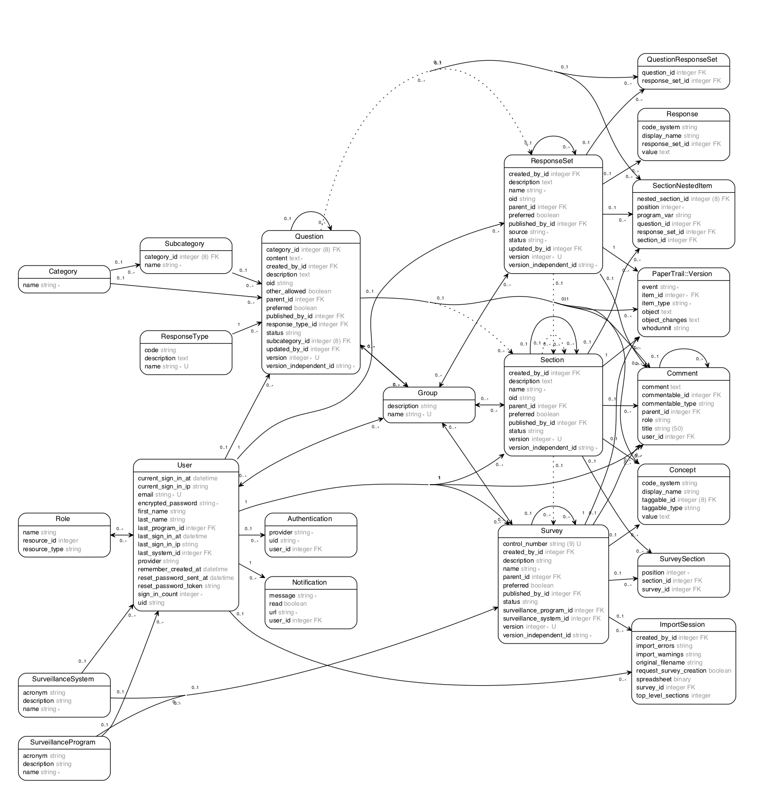

# SDP Vocabulary Service
Repository for the development of the initial Surveillance Data Platform (SDP) vocabulary service.

This GitHub repository was created for use by [CDC](http://www.cdc.gov) programs to collaborate on public health surveillance-related projects in support of the [CDC Surveillance Strategy](http://www.cdc.gov/surveillance). This third-party web application is not hosted by CDC, but it is used by CDC and its partners to share information and collaborate on software.

Please visit the [SDP CDC Web Site](http://www.cdc.gov/sdp) or [SDP Wiki](https://publichealthsurveillance.atlassian.net/wiki) for more information on the project and new services.

This service is designed as part of the SDP and other services are available through the [platform repository](https://github.com/CDCgov/SDP).

## Getting Started

### Prerequisites

The SDP Vocabulary Service requires: Ruby (version 2.3 or later), bundler (version 1.13.6 or later), Node.js (version 5.5 or later), Postgres (version 9.6 or later) and optionally Elasticsearch (version 5.3.1 or later), Chrome (version 59 or later), and ChromeDriver (version  2.30 or later).

#### Ruby >= 2.3
- We recommend using rbenv to install Ruby on Linux and MacOS: [Rbenv Installation Instructions](https://github.com/rbenv/rbenv#installation)
- Otherwise, install Ruby: [Ruby Installation Instructions](https://www.ruby-lang.org/en/documentation/installation/)
    
#### Bundler >= 1.13.6
- The gem command should be available after installing Ruby

```
gem install bundler
```

#### Node.js >= 5.5
- Please be careful if you are using a package manager to install Node.js on Linux, as the repositories often have versions that are too old
- If not using a package manager, install Node.js: [Node.js Downloads](https://nodejs.org/en/download/)

#### PostgreSQL >= 9.6
- Install PostgreSQL: [PostgreSQL Installation Instructions](https://wiki.postgresql.org/wiki/Detailed_installation_guides)
- You may need to install the server header files which will be used later to compile some ruby gems, for example on Ubuntu with PostgreSQL 9.6 you can easily install this package:

```
sudo apt-get postgresql-server-dev-9.6
```

- Make sure to create a default user (often the name of the local account you are running the project under) which can create and read databases. If you aren't sure what to call this user, you can find out by running the command 'psql' from your local unprivileged account with no arguments and looking for this error message:

```
psql: FATAL:  role "<username>" does not exist
```

- Create this missing user,  here is how to do this on Linux:

```
sudo -u postgres createuser -d <username>
```

#### (Optional) Install Elasticsearch >= 5.3.1
- This will allow advanced search features in the application, but is not necessary as there is a basic backup search system.
- Be aware, Elasticsearch can take up a lot of ram (2gb by default) and many file descriptors
- Install the Oracle JDK >= 1.8 : [Oracle JDK Installation Instructions](http://docs.oracle.com/javase/8/docs/technotes/guides/install/install_overview.html)
- Be careful, if another JDK is installed (Such as OpenJDK) there may be issues if Elasticsearch uses it (for example if JAVA_HOME is pointing to the wrong installation)
- Install Elasticsearch: [Elasticsearch Installation Instructions](https://www.elastic.co/guide/en/elasticsearch/reference/current/_installation.html)

#### (Optional) Install Chrome >= 59
- Needed for ChromeDriver to run Cucumber tests
- Install Chrome: [Chrome Download](https://www.google.com/chrome/browser/desktop/index.html)

#### (Optional) Install ChromeDriver >= 2.30
- Needed to run Cucumber tests
- Install ChromeDriver: [ChromeDriver Download](https://sites.google.com/a/chromium.org/chromedriver/)
- Make sure ChromeDriver is available in the system PATH or equivalent

### Install Dependencies

#### Ruby Dependencies

```
bundle install
```

- You will probably need a compiler and other build tools to successfully install these gems. On Ubuntu:

```
sudo apt-get install build-essential
```

- If you encounter errors referencing missing PostgreSQL files, you probably need to install the PostgreSQL headers as mentioned above in the PostgreSQL section.

#### Node Dependencies

```
npm install
```

### Set up the database
- If PostgreSQL is running and your user has been created, run these commands to initialize the database

```
bin/rails db:create
```

- Because of an Activerecord bug, you may need to run these migrate commands twice each (the first run will end prematurely, but the second run will complete successfully)

```
bin/rails db:migrate RAILS_ENV=development
```

```
bin/rails db:migrate RAILS_ENV=test
```

```
bin/rails db:seed
```

- Load some surveillance programs and systems from the jupiter service:

```
rake cdc:import_jupiter
```

- If you have your own programs and systems you would like to import, you can use these commands:

```
// A csv file with systems
rake cdc:import_systems[<your csv file with systems.csv>]

// A csv file with programs
rake cdc:import_programs[<your csv file with programs.csv>]

// An excel file with programs and systems
cdc:import_excel[<your excel file with programs and systems.xlsx>]
```

### Start the Service

```
foreman start -p 3000
```

### Run Tests

- Running the test suite requires the server to be running, see above
- Run the basic test suite:

```
rake
```

- If you wish to run the cucumber tests, which use a browser window to simulate user activity, you need to have installed Chrome and ChromeDriver (see above)
- Run Cucumber tests with:

```
bundle exec cucumber
```

- The cucumber tests may take 15 minutes or more to run

### Elasticsearch
- If you intend to use the Elasticsearch, it should always be running so it is updated as new objects are created. It will not be started automatically by `foreman start -p 3000`. Otherwise, you may be left with inconsistent and confusing search results.
- If your database and Elasticsearch ever get out of sync (for example objects were created while Elasticsearch was not available) you can sync them with the command:

```
rake es:sync
```

### Useful commands
- Create a new user (also available with the register link at the top of the application landing page)

```
rake admin:create_user[useremail@example.com, password123, false]
```

- Make a user a Publisher, or revoke Publisher status. A Publisher can see any draft items created by any other user, and move things from the 'Draft' state to the 'Published' state. A Published item can be seen by any user and can no longer be edited.

```
rake admin:make_publisher[useremail@example.com]
rake admin:revoke_publisher[useremail@example.com]
```

- Load test data. This data is not based on real data and does not look like real data, but will let you explore the application's functionality. Replace 'useremail@example.com' with an existing user account. This user will be the owner of the data:

```
rake data:load_test[useremail@example.com]
```

### Developer Notes

This application manages assets, such as JavaScript and CSS/SCSS with [webpack](https://webpack.github.io/). All development of assets should be done in the webpack folder.

## Database Model


To regenerate the ERD from the Rails database models, first install graphviz, then:

    rake generate_erd
    
## Public Domain
This project constitutes a work of the United States government and is not subject to domestic copyright protection under 17 USC Section 105. This project is in the public domain within the United States, and copyright related rights in the work worldwide are waived through the [CC0 1.0 Universal public domain dedication](https://creativecommons.org/publicdomain/zero/1.0/). All contributions to this project will be released under the CC0 dedication. By submitting a pull request, you are agreeing to comply with this waiver of copyright interest.

### License
The project utilizes code licensed under the terms of the Apache Software License and therefore it is licensed under ASL v2 or later.

This program is free software: you can redistribute it and/or modify it under the terms of the Apache Software License v2, or (at your option) any later version.

This program is distributed in the hope that it will be useful, but WITHOUT ANY WARRANTY, without even the implied warranty of MERCHANTABILITY or FITNESS FOR A PARTICULAR PURPOSE. See the Apache Software License for more details.

You should have received a copy of the Apache Software License along with this program. If not, see http://www.apache.org/licenses/LICENSE-2.0.html

## Privacy
This project contains only non-sensitive, publicly-available data and information. All material and community participants are covered by the [Surveillance Data Platform Disclaimer](https://github.com/CDCgov/template/blob/master/DISCLAIMER.md) and [Code of Conduct](https://github.com/CDCgov/template/blob/master/code-of-conduct.md). For more information regarding CDC's privacy policy, please visit http://www.cdc.gov/privacy.html.

## Contributing
Anyone is encouraged to contribute to the project by [forking](https://help.github.com/articles/fork-a-repo) and submitting a pull request. If you are new to GitHub, you might want to start with a [basic tutorial](https://help.github.com/articles/set-up-git). By contributing to this project, you grant a worldwide, royalty-free, perpetual, irrevocable, non-exclusive, transferable license to all users under the terms of the Apache Software License v2 or later.

All comments, messages, pull requests and other submissions received through CDC, including this GitHub page, are subject to the [Presidential Records Act](http://www.archives.gov/about/laws/presidential-records.html) and may be archived. Learn more at http://www.cdc.gov/other/privacy.html

## Records
This project is not a source of government records, but it is a copy to increase collaboration and collaborative potential. All government records will be published through the [CDC website](http://www.cdc.gov).

## Notices
Please refer to [CDC's Template Repository](https://github.com/CDCgov/template) for more information about [contributing to this repository](https://github.com/CDCgov/template/blob/master/CONTRIBUTING.md), [public domain notices and disclaimers](https://github.com/CDCgov/template/blob/master/DISCLAIMER.md), and [code of conduct](https://github.com/CDCgov/template/blob/master/code-of-conduct.md).
